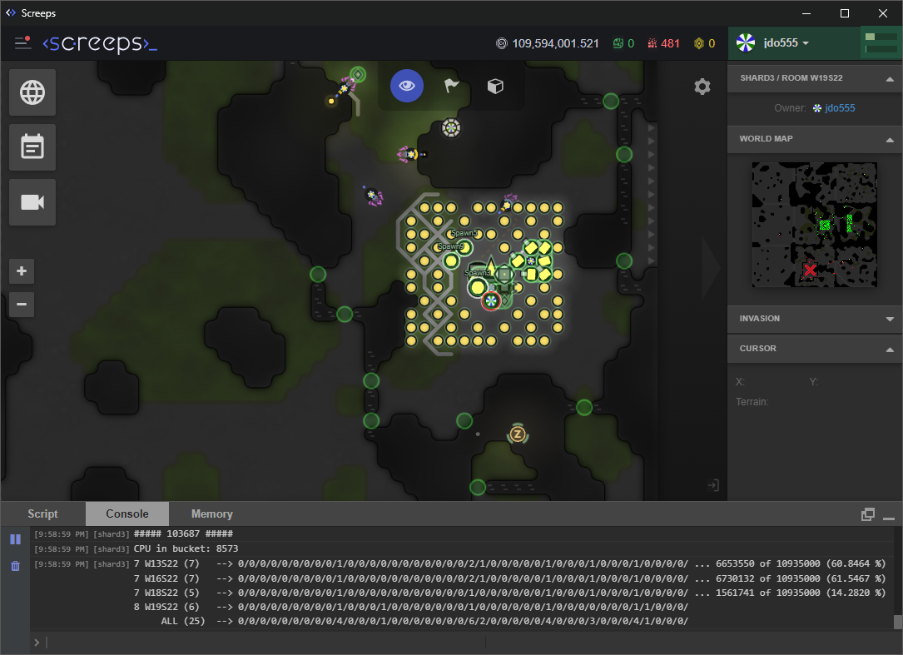

# ScreepsScript by jdo555



## About
This is my script for the game [Screeps](https://screeps.com/). I have worked on this script since at least 2020. I created this script mostly for fun and entirely from scratch, meaning that I made no referrence to anyone else's script in creating it; thus, it may be quite unique when compared to other existing scripts.

This script uses comparatively little memory, as it is largely dependent upon custom classes that hold all relevant data. First, there is the ***ScreepsScript*** class: this is the main class, and is the one that is used in the main loop (being initialized immediately beforehand), holding all necessary data throughout all subsequent game-ticks. Secondly, there is the ***Base*** class: each instance of this represents a single owned room, having all data relevant to that single owned room; each ***Base*** instance is held by the ***ScreepsScript*** object through the property ***bases***, which is an object that has each base-name as key and the ***Base*** object as value. I will continue to explain other details throughout this readme, but keep in mind that this code is fairly well explained through its local comments; please make direct referrence to such comments in the code for any information that is not covered here.

As for file organization, note that I have opted to keep all code within a single file in order to reduce the CPU usage of re-commits, and also for the sake of the convenient availability of constants used throughout the code.

## Objective of script
This script aims primarily to be efficient. The most rooms I have held at once with this script is 11 level 8 bases (with, of course, a max CPU of 20, as I have never paid for more CPU), with all bases still harvesting (energy, minerals, and extra resources) and upgrading the controller (for the purpose of increasing my GCL). With that many bases I still had on average 5 CPU or so to spare, and thus would almost never use the bucket except for re-commits or when multiple bases were under attack or otherwise made to be more active than usual. Note that bases perform at a much higher level of efficiency as they reach higher levels with this script; thus, contrarily, this script could not support nearly as many controller-level 1 bases, due to the far more numerous creeps and the inefficiencies of their corresponding roles at that level.

Secondarily, this script prioritizes allowing for more human interaction, so as to allow for the player to make strategic (or unstrategic or fun) choices, and to otherwise feel more involved. For example, this script was never set up to explore and automatically claim new bases; that is left up to the player. If you wanted to claim a new room, you'd have to create an ***mso*** (make spawn object) function like the following, ` mso(1, "claimer", "1i1m", {extraMemory: {targetRoom: "E9N19", task: 3}}) `, placing it in the correct spawn array of the base which will create the creep, and then the creep would be on his way (assuming you had previously filled out the ***travelObject*** -- which is an admittedly somewhat inconvenient approach to making inter-room travel more efficient). As another example, if you found a lot of energy lying around in a nearby room, you might create a few "energy looters" to go back and forth bringing it all home with the following, ` mso(3, "looterE", "15m15c", {extraMemory: {targetRoom: "E8N17"}}) `. To give one final example, if you had a hostile neighbor whom you wanted to aggravate you could select one of a number of different roles, creating an appropriate ***mso*** function in the appropriate place in order to bring about the regular spawning of a creep of that role, so that the creep would (according to its role) act against that neighbor.

## How automated is it?
Please note upfront that this script is to be considered incomplete. As stated above, I made no reference to other scripts in the creation of this one, and thus in areas such as the market, factory, and labs (among other places), this script is comparatively lacking as I never got around to working out a comprehensive approach to automating that area.

This script is primarily to be seen (currently) as an economic script, with plenty of options for commandeering the creeps to do things more manually. Assuming that the player has done the necessary setup (such as setting ***baseBuildDetails*** appropriately), once a room is claimed, all economic activities will be handled automatically (such as collection of energy and upgrading of controller, building of all structures, filling of towers, firing of towers, etc.). However, upon reaching controller level 4, 5, or 6 other manual player actions will need to have been done to ensure efficiency and continued functioning of bases. By controller level 4, it is usually optimal to have set up a ***dropMine***; by 5, it is necessary that at least 1 ***linkMine*** be set; by 6, both ***linkMines*** should have been set, and also and an ***upgradeLink*** if appropriate for the room. (For instructions on how to do all this, please see the examples in the room memory section.) Note also that the building of defensive walls and ramparts is also up to the player, but once the player has built and verfied them, they will be automatically handled thereafter. (To be clear, the construction sites for walls and (additional) ramparts must be manually placed by the player, after which the player may re-commit the code thereby triggering the spawning of a fortifier role, who will construct them all automatically; once construction is complete then the player must "verify" the new structures, causing them to be saved to room memory; to do this, follow the example of the last paragraph in the room memory section.)

## Base Templates
My script uses custom-made base templates to help with base automation. Please note upfront that the only templates that will work correctly with my script are those that follow an exacting format and that place certain structures in the room according to strict requirements; for an example of the "exacting format", see the ***ScreepsScript*** method ***prepareBaseDataAtInit()*** and the initialized array ***baseTemplates***, which includes all premade templates and illustrates the format requirements; by strict requirements on structure placement, I am referring to the fact that my script depends on having what I've called "central structures" (spawn, powerSpawn, storage, nuker, terminal, factory, and a single "central" link) all wrapping around a single room-tile for the sake of the overseer role, and, similarly, on having all towers wrapping around a single room-tile for the sake of the towerCharger role. There are currently only three templates: 0 and 1, which are square-like with 1 being more condensed; and 2, which is a long rectangle. Note that templates can be rotated to fit better in a room; this is particularly useful for template 2.

There is currently no automation of the template placement, thus the anchor point for a template must be manually coded into the script when claiming a new room. To determine the anchor, you will first need a room that can accommodate the template size (according to its noted height and width as a rectangle) such that no wall occludes any point in the template's rectangular shape; the very top-left point of that rectangular shape is the anchor; note its coordinates. The ***ScreepsScript*** object ***baseBuildDetails*** must be configured to contain the appropriate details. This is easiest to illustrate by example. When you own a single room, such as "E54S49" then the ***baseBuildDetails*** object could be configured within the ***ScreepsScript*** method ***prepareBaseDataAtInit()*** as follows:

```javascript
this.baseBuildDetails = {
    E54S49: {
        baseType: 1,
        template: 1,
        anchor: [22,20],
        autoRoads: false,
    },
}
```

Other bases would need to be added manually in the same way, and the code would need to be re-committed afterwards so that the necessary room-memory and such could be prepared.


## First Spawn (or Respawning)
Due to how respawning works in *Screeps*, in order to use my script with its base templates, you must manually place the first spawn in your first room according to exact positioning within the chosen template. Of course, you will first need to decide on the anchor point, see paragraph 2 of the Base Templates section for more information on how to do this. Once you know the coordinates of the anchor, simply add the coordinates of the of the controller level 1 spawn to the anchor coordinates to get appropriate coordinates for manual placement of spawn; thus, for example, with TEMPLATE 1 (where the spawn is at [5,6]), with the anchor set to [22,20], then you would need to manually place the first spawn at [27,26] (because 22+5 is 27, and 20+6 is 26). Although this process is inconvenient, you will only ever have to do it when placing your very first spawn.


## Room memory
My script uses room memory primarily to keep track of unchanging data pertaining to base set-up. Once a room is claimed, and data is appropriately set in the ***ScreepsScript*** object ***baseBuildDetails***, then, at the first re-commit following the initial claiming, all room memory for that room will be set; this includes all structure placement based on the chosen template, static role positions (such as overseer position and towerCharger position), static "mine" data (such as harvestingMines or upgradeMines), extractor location, auto-roads, and more.

Other structures that either need verification of correct placement or that benefit from optimal user placement depend on placement of flags to trigger the setting of room memory; this applies to dropMines, linkMines, controllerLinks, etc. Note that flags can also be used to automatically prepare room memory that indicates waiting positions for inactive creeps, or to prepare room memory that indicates coordinates where autoroads should be disallowed. Please see the "flag section" in the method ***prepareRoomMemory*** for more details about how to use flags. Here, though, I will provide a brief example of how to setup linkMines for a base. Use the create-flag function in the *Screeps* GUI to create the flag manually, giving the flag a name that accords to the flag type; thus, to create two linkMine locations in your room, you would place two flags, one named (for example) "lm_1" and the other "lm_2", placing them such that each one is no more that 2 spaces from the source, while also not obstructing the mining creep's position, for each distinct source; after re-committing the code, assuming the flags were placed in valid locations, they would disappear and all appropriate room memory for linkMines would be filled out based on flag locations, thereby allowing for the later automatic creation of linkMines and linkMiners, once appropriate. If, however, you decided later (before any linkMines had been constructed) that you wanted linkMines in different places or in a different order, you could simply enter the following into the console ` Game.rooms["*provide_room_name_here*"].memory.linkMinesSet = false; `, and then place flags again and then re-commit once more.

There are also other important room memory options pertaining to things like defensive structures, manual roads, and more. I'll leave it to the code's comments to explain most of this, but I'll give one example with walls. Walls are not created automatically through any base template or any other functionality, and it is instead expected that the user will manually build their own walls for the sake of optimal strategic placement. Once walls are complete (as in, existing with at least 1 health point), then the user should execute the following code in the console: ` Game.rooms["*provide_room_name_here*"].memory.outerFortificationsSet = false; `. After this, you must re-commit the script, thereby causing OUTER_FORTIFICATION room memory to be updated with current data about placement of walls (and also "other" ramparts) so that they will be auto-constructed thereafter if ever destroyed.

## Roles
I have created a sizable number of roles within this script. Each role is basically a behavior or action pattern for a living creep. Every creep is assigned a role at birth (by having the corresponding role string set in the creep's memory), and it behaves then according to that role. It is strongly recommended that the user NOT change a creep's role manually through the memory console, particularly for certain base-specific roles. Although you may find that you can manually change roles through the memory console without any obvious issue for certain simpler roles, this is not an intended feature of the script, and it leads to role-count issues (that are admittedly easily fixed through a re-commit).

The count of active roles in a base is determined through the spawn-arrays, which are described below. Note that each spawn-array consists of many calls to the ***mso*** (make spawn object) function, which generates an appropriate object at code-commit time. For the sake of clarity, note that the first number as seen in the ***mso*** parameters is a number that indicates the maximum count allowed for the associated role, implying that for every base there will only ever be allowed (by that singular ***mso*** object) so many creeps of that role, even when creeps are spawned from another base with the spawnFor option.

### Controller-level based spawn-arrays
The spawning of creeps of different roles is handled through the function ***attemptToSpawn***. Every tick, a single base (rotating in repeating order through all the player's claimed bases such that only a single base makes this attempt per tick) attempts to spawn a creep through each of its spawns. All bases will follow the ordering as dictated by the object ***spawnArraysByControllerLevel***, which lists out all units to attempt to spawn according to the current controller level of the base. To clarify by example, the controller level 3 and 4 parts look like the following:

```javascript
{
    // 1-2 removed for example
    3: [mso(2, "fighter", "2a2m"),
        mso(-1, "harvester", "6m3w3c"),
        mso(-1, "harvester", "4m2w2c"),
        mso(-1, "harvester", "2m1w1c"), // cheaper harvesters will be spawned if more a efficient one cannot be afforded
        ],
    4: [mso(2, "fighter", "1t4m3a"),
        mso(-1, "scavenger", "3c3m"),
        mso(-1, "harvester", "6m3w3c"),
        mso(-1, "harvester", "4m2c2w"),
        mso(-1, "harvester", "2m1w1c"),
        mso(1, "distributor", "3c3m"),
        mso(-1, "dropMiner", "6w7m1c", {required: true}), // if dropMiner's condition is met but cannot be afforded, attempts will stop
        mso(-1, "gatherer", "8m8c"),
        mso(1, "towerCharger", "2m2c"),
        mso(1, "paver", "6m3w3c"),
        mso(1, "upgrader", "4w2c6m"),
        mso(1, "upgraderS", "6w3c9m"),
        ],
    // 5-8 removed for example
}
```

Note that the full object covers controller levels 1-8 and is not meant to be adjusted or changed at all generally. To return to the example, if the base were controller level 3 and its turn to attempt to spawn had arrived, it would first attempt to spawn the fighter by checking the spawn condition for a fighter role; if that condition were false it would immediately try to spawn the harvester. As harvesters are an automatically handled role, with their max-count depending on the number of spaces around a source, this role has a -1; thus, if that max-count had not been reached and all other spawn conditions were met, this harvester would be spawned if the according body type represented by the string "6m3w3c" (meaning 6 MOVEs, 3 WORKs, and 3 CARRYs) could be afforded. Let's say the spawns/extensions didn't have enough energy to spawn a harvester with those parts, though; then, immediately the next mso generated object would be analyzed, the harvester with the "4m2w2c" body; if it could be afforded, then spawning would be scheduled and this process of simply iterating through the array of ***mso*** generated objects would immediately stop for the spawn that finally scheduling spawning. For clarity, note that each spawn in a base (when more than one exist) goes through this process such that in a single tick up to three spawns in one base may schedule spawning.

### Base-specific spawn-arrays

For base-specific spawning there is also the ***spawnArraysByBase*** object. This object is meant to be fluid and changing, and it is through this object that you will do all specific and circumstantial spawning per base (irrespective of the controller level of that base). Spawning through this object is the same as through the ***spawnArraysByControllerLevel*** object, but it is of a lower priority, with all spawning attempts as dictated by ***spawnArraysByControllerLevel*** happening first, and base-specific ones afterwards. Here is an example of the object:

```javascript
this.spawnArraysByBase = {
    E54S49: [
        mso(1, "claimer", "1i1m", {extraMemory: {targetRoom: "E52S47", task: 3}}),
        mso(1, "scavenger", "8c8m", {forceCondition: true}),
        mso(1, "looterM", "13c13m", {spawnFor: "E53S48", extraMemory: {targetRoom: "E53S47"}}),
        mso(2, "attackerX", "20a20m", {extraMemory: {targetRoom: "E53S49", targetID: "607d964bcf415432f6b5c366"}}),
    ],
}
```

To explain, with the object set in this way: a claimer would be regularly spawned (thus you would want to remove this line after success) in E54S49 and would then move to targetRoom to claim it; a single scavenger would be spawned in the base (E54S49) irrespective of the return value of its spawn-condition (because of the option forceCondition); a looterM would be spawned in E54S49 but his base would be set to the spawnFor value (instead of the spawning base), and he would immediately go to the target room to collect any minerals found in ruins, graves, etc., returning all of it to the storage in is base; and, finally, there would be at most 2 attackerXs whose only action would be to move to targetRoom to attack the target whose ID is targetID.

### Other information about spawn-arrays

Keep in mind that a malformed ***mso*** function will cause an error at commit-time; the error should inform you of the problem so that you can immediately fix it and re-commit the code again. Problems specific to the additional options provided to the ***mso*** will do likewise. Keep in mind that for some roles there are additional requirements for what must be set with the extraMemory option; here, too, errors will trigger to informing you of anything missing.

For more details about the ***mso*** function, the ***spawnArraysByControllerLevel***, the ***spawnArraysByBase***, or the tests relating to the validity of any of these, see the ***ScreepsScript*** method ***createSpawnObjectsAtInit***. Note that the function ***createCreepBodyFromString*** can also be found there if that function interests you.

## Bugs and other issues
Throughout my code, there are comments whose text has been preceded by "!!!!!" or "!!!"; this indicates a place in the code where there is, in that local section of code, significant room for improvement or some sort of an issue to be addressed. Note that comments preceded by "!" are simply notes of greater importance that explain things that may be either very important or sometimes not particularly obvious.

I have recently respawned in the game to try running things from the beginning and have verified that nearly everything works as expected. A few issues do remain, however, such as how at controller level 5 ramparts that where intended to be built over central important structures do not get their construction sites set due to the main structure still existing only as a construction site. (This can be resolved by waiting long enough -- until the controller levels up again -- or by performing another recommit once the main structure is complete.)

Other issues or bugs likely exist.

## Plans for improvements
I do not currently have any significant plans for improving this script, even though there is certainly a lot of room for improvements. I have, however, made some (very disorganized) notes about ideas for the script; these notes can be found [HERE](./other/todo_and_other_notes.txt).
